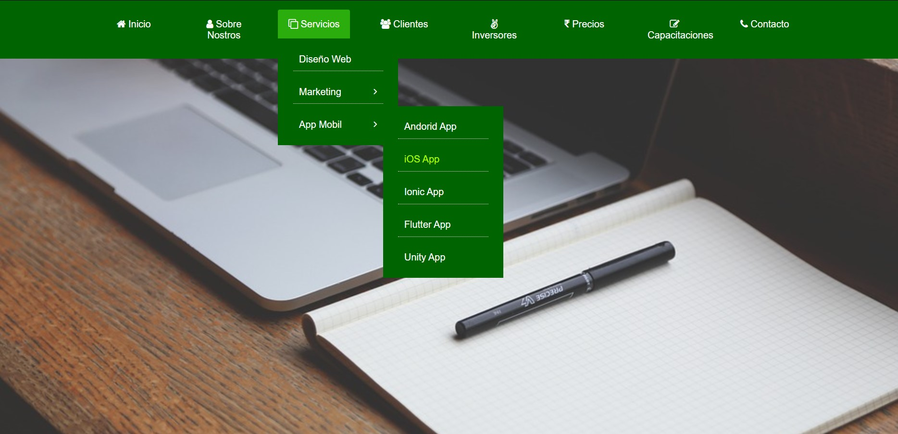

# Menu-desplegable-en-HTML-y-CSS
una barra de Menú la cual tiene un efecto desplegable en algunos de sus botones, como atributo, pudiendo mostrar mas propiedades ocultas dentro del mismo menú, 
hecho en HTML y CSS.

  
  
  
    

## ¿Cuál es el fin de este proyecto? 
es una vista muy basica hecha en HTML y CSS, con el fin de aprender a usar y manejar propiedades que nos ayuden como usuarios a desarrollar ideas para el manejo y
el desarrollo web.

## ¿Puedo Probar este Proyecto en Linea? 
Si, Puedes probarlo en linea haciendo click [aqui](https://carlosorellana00.github.io/Menu-desplegable-en-HTML-y-CSS/)

## ¿Cómo puedo probarlo de manera local en mi equipo?
puede copiarse directamente desde git a traves de comando o descargarse en un archivo Zip, el proyecto no requiere de ningun servicio de servidor para correrse
de manera local en una computadora.

## ¿Cómo se nos presenta?

  

  

  

  

  

  

## Agradecimientos y Referencias:

- [Autor Original -> Easy Tutorials](https://www.youtube.com/c/EasyTutorialsVideo/featured)
- [Video Original -> How To Make Drop Down Menu Using HTML And CSS | HTML Website Tutorials](https://www.youtube.com/watch?v=wHFflWvii3M&t=591s)

